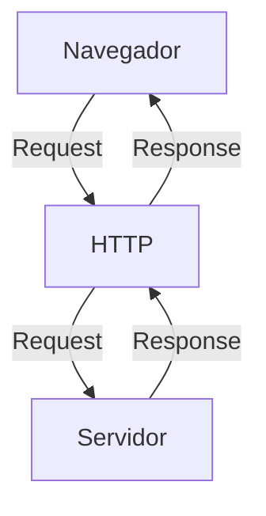
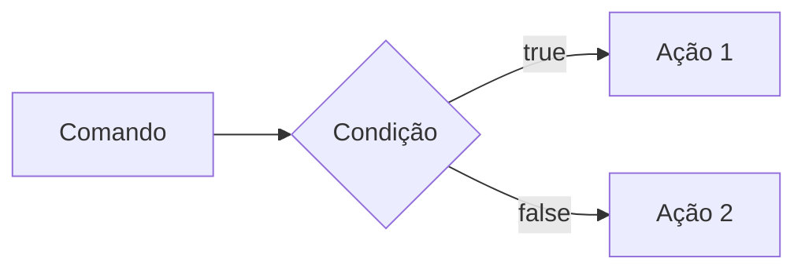
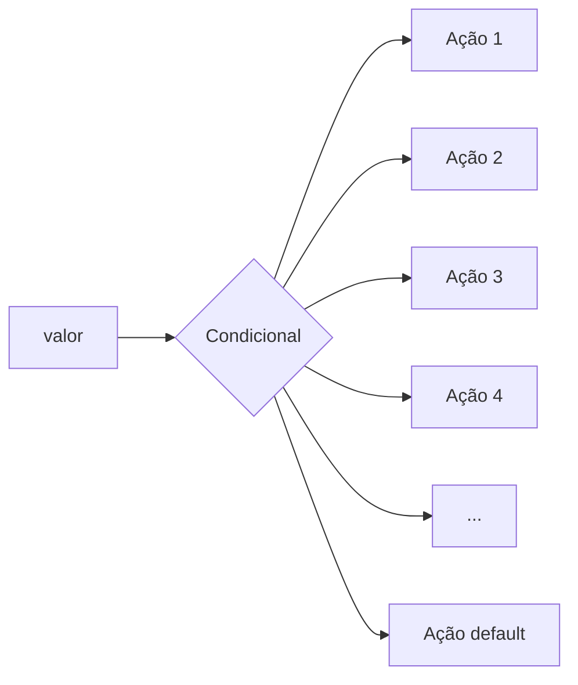
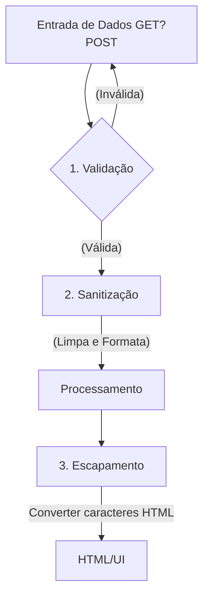

Prof. Diogo Barbosa

Escola Senai Americana

2 Semestre 2026

## Objetivos de Curso

# Objetivos do Curso

- Desenvolver aplicações web Serve Side, utilizando a línguagem PHP;
- Aplicar Sintaxe native PHP Vanilla;
- Manupulação HTTP;
- Persistência de Dados (Armazenamento em BD);
- Segurança contra SQL Injection/CSRF;
- Refatoração em POO (Programação Orientação Objetivo);
- Arquitetura MVC;
- Utilização do FrameWork  Laravel;

## Cronograma do Semestre
  
Carga Horária: 105h

Duração: 20 semanas

### Semana 1: Introdução ao Backend e configuração do Ambiente PHP

#### O que é Backend
 
 O back-end é a parte de um site ou aplicativo que o usiário não vê, mas que faz tudo funcionar por trás das telas.

 - Guarda e organiza informações em um banco de dados;
 - Confere se o  login e a senha estão corretos;
 - Calcula valores, como frete ou total de uma compra
 - Garante que os dados de um usuário não apareçam para outro;
 - Faz o sistema suportar muitas pessoas usando ao mesmo tempo, sem travar.

As principais linguagens utilizadas no desenvolvimento back-end são PHP, JavaScript/TypeScript, Python, Java , Kotlin, Go (Golang), C# e Rust. 

O backend é o "cérebro" oculto de um site ou aplicativo. Ele roda em um servidor e cuida de tudo o que o usuário não vê na tela.

**As 3 partes básicas de todo backend:**

1. **Servidor:** o "computador" que fica ligado esperando pedidos (requisições);
2. **Banco de dados:**  onde as informações ficam guardadas (usuários, produtos, mensagens, etc.);
3. **Lógica de negócio:**  as regras do sistema (ex: "não deixa comprar se não tiver estoque").

**O Mercado de Trabalho em Back-end**

O desenvolvimento Back-end é uma das áreas mais cruciais da Tecnologia da Informação. 

- Com a transformação digital acelerada, empresas de todos os portes e setores dependem de infraestruturas sólidas e seguras. 

- Setores de Atuação: Bancos, hospitais, e-commerces, logística, indústrias, startups e órgãos públicos utilizam Back-end para suportar suas operações críticas.

- Fatores de Crescimento: O avanço da computação em nuvem, aplicativos móveis, Big Data e IA impulsiona continuamente a busca por profissionais da área.

- Modelos de Trabalho: Alta flexibilidade com vagas presenciais, híbridas e remotas (inclusive com oportunidades internacionais).

#### Ciclo de Vida da Requsição HTTP

##### O que é HTTP

**HTTP**, Hypertext Transfer Protocol, é um protocolo de comunicação utilizado para transferência de informações na WWW(World Wide Web) e em outros sistemas de Redes.

O HTTP é a base para que o cliente e um servidor web troquem informações. Ele permite a requisição e a respostas de recursos, como imagens, arquivos e as própias páginas web, por meio de mensagens padrão (protocolo).

##### Como Funciona o HTTP

1. O cliente estabele contato com o servidor, encamihando uma requisição HTTP;
2. Nessa Requisição o cliente especifica o método pretendido (read-GET, create-POST, update-PUT/PATCH, delete-DELETE)
3. o Servidor processa e responde com uma mensagem HTTP, com os recursos solicitado.



#### Como Funciona na Prática o BackEnd

- **Ação do Usuário**: Envia uma Solicitação pela UI(Interface do Usuário). Exemplo de UI: Tela do Celular, Navegador da Internet, Alexa ...
- **Envio do Requisição**: A UI transforma ação do Usuário em uma Requisição HTTP
- **O Processamento BackEnd**: o Código Backend recebe o pedido, valida os dados e decide o que fazer (Ex: consulta uma informação no banco de dados)
- **Resposta**: O servidor devolve o resultado para a UI (Ex. Um Login Autorizado, Uma Compra Confirmada, )

#### Tipos de Requisição HTTP

Os tipos de de requisição HTTP indicam a ação que o usuário deseja executar no servidor. As principais ações são:

- **GET**: Pede dados de um lugar especifico. "Não Faz Alterações no Servidor"
- **POST**: Envia dados novos para *criar* algo ou processar informações.
- **PUT/PATCH**: Modificar dados já existentes. *PUT* Atualização Total dos dados. *PATCH* Atualização Parcial dos dados.
- **DELETE**: Apaga um dado do Servidor

---

#### Iniciando o PHP

##### O que é PHP

**PHP** (Hypertext PreProcessor) é uma liguagem de programação interpretada e open source, focada no desenvolvimento de sistemas para web, pode ser usada junto com HTML para criação de págians web dinâmicas.

##### Instalando o PHP

- Fazer o Download do PHP (php.net);
- ZIP - Non Thread Safe 8.5
- Descompactar o Arquivo do PHP na pasta C:\src\php (Para Descompactar, usar o 7Zip = Melhor) => nunca salvar arquivo na raiz do sistema(C:)
- Modificar o arquivo php.ini-development para => php.ini ( criar as configurações do PHP na Máquina) - adicionar ou remover funcionalidade do PHP
- Adicionar a Pasta do PHP(C:\src\php) as Variaveis de Ambiente do Sistema (PATH)
- verificar a instalação rodando o Comando php --version

##### Contextualizando o PHP

O PHP de fato é uma das linguagens de programação mais populares da atualizada. Ela permite que você crie aplicações web robustas, de uma maneira muito simplifica e direto ao ponto. Sem contar que a linguagem traz diversos recursos que facilitam e aceleram o processo de desenvolvimento de sites e sistemas para web. E além do mais, ela ainda tem um ótimo ecossistema, uma excelente comunidade e um grande mercado de trabalho. 

#### Criando Minha Primira Aplicação em PHP

Criando um Hello, World!!!

#### Criando o Perfil de PHPVanilla

-> Profile -> New Profile
-> Extensions:
- PHP Intephense ( A do Elefantiinho): AutoCompletar (Snipets)
- PHP Debug (Xdebug): Acha Erros em linha de código
- PHP CS Fixer: Formatação padrão do código (Identação)
- PHP Server: Sobre um Servidor Local para Acompanhamento em Tempo Real
 
 ### Estudo de Variáveis e Constantes em PHP

 Declarar variáveis é alocar um espaço na memoria que permite a inclusão e manipulação de dados.

 **Variáveis**

 -devem ser declaradas usando "$" antes do nome da variável
 - podem ser String, Nuérica (Integrar e float), a tripagem é atribuida ao adicionar o valor
 -São não tipadas ( não precisa declara o tipo na criação), a tripagem é atribuida ao adicionar o valor
- U sar o "declare(strict_types=1);" na primeira linha do arquivo ; => blindar o sistema contra conflitos de tipos de variáveis
                                                                                           
**Constantes**

- não podem ser modificas ou redeclaradas após a criação
- pode ser criada usando "const" ou "define"
- não permitem interpolação

---

### Semana 2 - Operadores em PHP (Aritméticos, Relacionais e Lógicos)

#### Estudos de Operadores

**Aritméticos**: São usados para realizar cálulos.

| Operador | Nome | Exemplo | resultado |
| - | - | - | - |
| + | Adição | 10 + 5 | 15 |
| - | Subtração | 10 - 5 | 5 |
| * | Multiplicação | 10 * 5 | 50 |
| / | Divisão | 10 / 5 | 2 |
| % | Módulo (Resto) | 10 % 3 | 1 (19 div 3 de 3, sobra 1) |
| ** | Expoente | 2 ** 3 | 8(2 elevado a 3) |

obs: O Operador % é o melhor amigo de um programador, permite ordenar listas e organizar fila e pilhas 

**Relacionais**: Permitem uma comparação entre dois ou mais valores, o resultados de uma operação relacional é sempre uma booleana (true , false)

| Nomes | Operador | Exemplo | Resultado |
| - | - | - | - |
| Iguais | == | "10"==10 | true |
| Igualdade Escrita | === | "10"===10 | false|
| Diferente | != | "10!===10 | false
| Diferença Escrita | !== | "10!==10 | true
| Maior que | > | 18 > 18 | false |
| Menor que | < | 10 < 20 | true |
| Maior ou Igual | >= | 18 >= 18 | true |
| Menor ou igual | <= | 10 <= 5 | false |

**Lógicos**: Permite a Combinação entre sentenças.

- operador AND (E) => && : para o resultado ser verdadeiro, TODAS as combinações precisam ser verdadeiras
  -true && true => true
  -true && false => false

- Operador OR (OU) => || : para o resultado ser verdadeiro, Basta APENAS UMA condição ser verdadeira
  - false || true =>
  - false || false => false 

- Operador NOT (não) => ! : inverte a lógica da sentença 
  - !true => false
  - !false => true

### Semana 3- Estrutura de Contole de Dados ( Condicionais e Repetição)

- **Contúdo**: Estruturas `if`, `elseif`, operadores ternários, `match`,  => substituto do `swicth/case`, loops `for`, `while`, `do-while` e `foreach`

#### Estrutura de controle de dados ajudam no processo de automatização em programas e sistemas
 
 #### Condicionais (IF, ELSE, ELSEIF)
 
 **Foma de Uso**:

 - Uso do `if`apenas:
 Exemplo: aplicar um desconto de 10% em compras acima de 100 Reais;

 ```mermaid

 graph lr
    A[comando] --> B[condição] --> C[Tomada de Decisão]

```

```php
if ($valorCompra > 100) {
  $valorCompra = $valorCompra * 0.9
}
```

- Uso do `if` e do `else`
Exemplo: Aplicar um desconto de 10% para compras acima de 100 reais e 5% para as demais compras



```php

if($valorCompra > 100) {
  $valorFinal = $valorCompra*0.9;
} else{
  $valorFinal = $valorCompra*0.95;
}

```

- Uso do `elseif` (Encadeado)
Exemplo: Compras acima de 200 reais tem 15% de desconto, acima de 100 reais tem 10% de desconto e outras 5% de descontos

```mermaid

graph LR
   A[Comando] --> B{Condição}
   B --> |true| C[Ação 1]
   B --> |false| D{Condição 2}
   D --> |true| E[Ação 2]
   D --> |false| F[Ação 3]

   ```

   ```php

   if($valorCompra > 200){
    $valorFinal = $valorCompra*0.85;
   } elseif($valorCompra .100) {
    $valorrFinal - $valorCompra*0.9;
   } else {
    $valorFinal = $valorCompra*0.95;
   }

   ```

   *obs*: sempre Usar `elseif` para situações que precisam de mais de uma condição, ou seja, fazer encadeamento das condições.

   - Uso **Errado** do if

   Não Fazer o Encadeamento de condicionais

   ```php

   if($valorCompra > 200) {
      $valorFinal = $valorCompra*0.85;
   }
   if($valorCompra > 100) {
      $valorFinal = $valorCompra*0.90;
   }
   if($valorCompra < 100) {
      $valorFinal = $valorCompra*0.95;
   }

   ```


   
   #### Operadores Ternários
   Um atalho para a estrutura condicional `if/else`, normalmente escrrito em uma unica linha de código

   `condição ? verdadeira: falso`

   Perfeito para decições curtas de uma linha de comando
   Exemplo: Verificar se a pessoa é maior de idade(18)
     
```php

$idade = 20;
//O formato é : (cindição) ? verdadeiro : falso

$status = ($idade >= 18) ? "Maior de idade" : "Menor de idade";
$status2 = ($idade<18>) ? "Criança" : ($idade<60>) ? "Adulto" : "Idoso";

```

#### Expressão `Match` (PHP 8)

No mercado de PHP atual, não se usa mais uma dezena de `if/elseif` para checar valores fixos, e o antigo `switch/case`caiu em desuso. Usamor o `match`. Ele compara um valor e retorna diferetamente o resultado.



```php

$diaSemana = date("Week"); //pega o Dia da Semana em Formato Numérico

//transformar dia da Semana em Formato de texto (Domingo, Segunda,...)

$nomeDiaSemana = match($diaSemana){
  "0" => "Domingo",
  "1" => "Segunda",
  "2" => "Terça",
  "3" => "Quarta",
  "4" => "Quinta",
  "5" => "Sexta",
  "6" => "Sábado",
  defalt => "Dia Inválido"
};

```

---

##### Laços e Repetição

Um laço de repetição faz com que, um bloco de códigos de rede várias vezes, até que uma condição mande parar.

- O laço `while` (Enquanto)

Ele verifica se a condição é verdadeira ANTES de entrar no laço. Ideal quando você nâo sabe quantas vezes vai rodar o laço.

```mermaid

flowchart LR
  
   A[Início] --> B{Condição}
   B --true--> C[Executa o Laço]
   C --> B
   B --false--> D[Interrompe o Laço]

   ```

   Exemplo: Jogo de Adivinhação de um n Secreto

   ```php

   $numeroSecreto = 7;

   $tentativas = 0;

   while($tentativa != $numeSecreto){
    echo "Tente Novamente"
    //vou pegar um n aleatório entre 1 e 10
    $tentativa = rand(1,10);
   }

   echo "Acertou Misevi!!! o n secreto é $numeroSecreto";

   ``` 

   - O laço `do-while` (Faça-Enquanto)

   A diferença é que ele executa o bloco pelo menos uma vez, mesmo que a condição seja falsa desde o início, pois ele só pergunta no final

   ```mermaid

   flowchaRt LR

   A([Início]) --> B[Executar Ação]
   B --> C{Condição}
   C --true--> B
   C --false--> D([Fim])

   ```

   exemplo: Jogo de Adivinhação

   ```php

$numeroSecreto = rand(1,10);

do {
    $tentativa = rand(1,10); //Simular um palpite aleatório

    if($tentativa == $numeroSecreto){
        echo "Parabéns, Acertou!!!";
    }
  
} while ($tentativa != $numeroSecreto);

   ```

obs:Uso ideal do `do-while`, Menus de sistema ou sistema de solicitação de dados, sistemas interativos; 
```
---

#### O Freio de Emergência: `break` e `continue`

As vezes precisamoso interferir no laço enquanto ele está rodando 

- `break`=> **Para Tudo!** Quebra o laço interiro e avai embora
- `continue` => **Pula a rodada!** Ele ignora o código daquela rodada especifica e pula logo par a próxima repetição.

Exemplo de Aplicação do Código: Sistema de Controle do Elevador

```php 

for($andar = 1 ; $andar<=10; $andar++){
    if($andar ==4){
        echo "Andar $andar está em obras. Passando direto!";
        continue;
    }

    echo "Elevador parou no andar $andar"
}

```
---

#### Laço de Repetição `for`

Use o `for`quendo você sabe quantas vezes precisa repetir uma ação ou quando precisa controlar um contador. Ele possui 3 partes:

- inicialização;
- condição;
- incrementação;

Sintaxe:

for(inicialização; condição; incremento){
   Ação
}

```mermaid
flowchat LR
A[Início: i=0] --> B{i<10?>}
B--true--> C[Ação]
C---> D[i++]
B --false--> E[FIM]
```

Exemplo de Aplicação: Exibir todos os Meses do Ano

```php
for($mes=1;$mes<=12;$mes++){
   echo "Mês $mes";
}
```
Nesse Exemplo, `$mes` começa em 1, o laço continua enquanto `$mes`for menor ou igual a 12 e, ao final de cada repetição, `$mês` aumenta o contador em 1

#### Laço de Repetição `foreach`

Use o `foreach` quando percorrer cada item de um **array**. Ele acessa os elementos diretamente, sem que você precise controlar o contador.

Exemplo: Imprimir todos os itens de um vetor.

```php
$frutas = ["Maça", "Banana", "Uva", "Laranja"];

foreach($frutas as $fruta) {
   echo "Fruta: $fruta";
}
```

Outr Exemplo: Acessar a chave e o valor de cada item:

```php
$preços = [
"Caderno" => 25.00,
"Caneta" => 5.50,
"Mochila" =>99.00
]; //Vetor não ordenado do tipo chave(Key) => Valor(Value) ===> Coleção/Dicionário

//percorrer o vator usando o laço Foreach
foreach($precos as $produto => $preco){
   echo"$produtos: R$" . number_format($preco,2);
}
// acessa a chave e o valor de cada item valor
``` 

---
---

#### Desafio : Simulador de cobrança (FINANSENAI)

#### Desafio Final

---
---

#### Semana 4- Modularização com Funções

#### Principio de DRY (Don't Repeat Yourself)

se uma lógica foi escrita duas ou mais vezes dentro de um código, essa lógica deve virar uma função.

#### Funções Nativas do PHP

O PHP tem milhares de funções prontas, essa função já criada é chamado de função nativa.

- **O que é uma Função**

uma função é como uma máquina: você coloca a matéria- prima (Parâmetro), ela processa e devolve um produto final (Retoeno)

Exemplo de Função Nativa

```php
$texto = "senai americana";

// uasra uma função nativa para substituição de parte do texto ==> str_replace
$textoNovo = str_replace("americana", "são paulo", $texto);
// "senai são paulo"

//usar uma função nativa para substituição das letras minusculas por letras maiúsculas => strtoupper
echo strtoupper($textoNovo);
```

#### Principais Funções Nativas (Mais utilizadas)
As funções abaixo já fazem parte do PHP e podem ser chamadas diretamente no código. Observe os parâmetros que cada uma recebe e o tipo de informação que ela retorna.

| Função | Categoria | O que faz | Como usar |
|---|---|---|---|
| `strlen()` | Strings | Retorna a quantidade de caracteres de um texto. | `$tamanho = strlen($texto);` |
| `strtoupper()` | Strings | Converte o texto para letras maiúsculas. | `$resultado = strtoupper($texto);` |
| `strtolower()` | Strings | Converte o texto para letras minúsculas. | `$resultado = strtolower($texto);` |
| `ucfirst()` | Strings | Converte a primeira letra do texto para maiúscula. | `$resultado = ucfirst($texto);` |
| `trim()` | Strings | Remove espaços e quebras de linha no início e no fim do texto. | `$limpo = trim($texto);` |
| `str_replace()` | Strings | Substitui uma parte do texto por outra. | `$novo = str_replace("-", "", $cpf);` |
| `substr()` | Strings | Extrai uma parte do texto a partir de uma posição. | `$inicio = substr($texto, 0, 3);` |
| `explode()` | Strings | Divide um texto e cria um array usando um separador. | `$palavras = explode(" ", $nome);` |
| `implode()` | Arrays | Junta os itens de um array em um único texto. | `$lista = implode(", ", $nomes);` |
| `count()` | Arrays | Conta a quantidade de itens de um array. | `$total = count($produtos);` |
| `in_array()` | Arrays | Verifica se um valor existe dentro de um array. | `$existe = in_array("SP", $estados, true);` |
| `array_push()` | Arrays | Adiciona um ou mais itens ao final de um array. | `array_push($nomes, "Ana");` |
| `array_pop()` | Arrays | Remove e retorna o último item de um array. | `$ultimo = array_pop($nomes);` |
| `sort()` | Arrays | Ordena um array em ordem crescente e reorganiza suas chaves. | `sort($notas);` |
| `array_keys()` | Arrays | Retorna um array contendo as chaves de outro array. | `$chaves = array_keys($produtos);` |
| `number_format()` | Números | Formata um número com casas decimais e separadores definidos. | `$preco = number_format($valor, 2, ',', '.');` |
| `round()` | Números | Arredonda um número para a quantidade de casas informada. | `$media = round($nota, 2);` |
| `max()` | Números | Retorna o maior valor de uma lista ou array. | `$maior = max($notas);` |
| `min()` | Números | Retorna o menor valor de uma lista ou array. | `$menor = min($notas);` |
| `is_numeric()` | Validação | Verifica se o valor é um número ou uma string numérica. | `if (is_numeric($entrada)) { ... }` |
| `isset()` | Validação | Verifica se uma variável existe e não possui valor `null`. | `if (isset($usuario)) { ... }` |
| `empty()` | Validação | Verifica se uma variável está vazia. | `if (empty($pedido)) { ... }` |
| `date()` | Data e hora | Formata uma data ou hora conforme uma máscara. | `$hoje = date('d/m/Y');` |
| `file_exists()` | Arquivos | Verifica se um arquivo ou diretório existe. | `if (file_exists('dados.txt')) { ... }` |

| `file_get_contents()` | Arquivos | Lê todo o conteúdo de um arquivo ou endereço. | `$conteudo = file_get_contents('dados.txt');` |
| `file_put_contents()` | Arquivos | Grava conteúdo em um arquivo, criando-o se necessário. | `file_put_contents('log.txt', $mensagem);` |

**Atenção:** algumas funções modificam o array original, como `sort()`, `array_push()` e `array_pop()`. Já outras retornam um novo valor, como `count()`, `explode()` e `str_replace()`. Em caso de dúvida, consulte a documentação oficial do PHP e verifique o retorno da função.

#### Documentação PHP

[Acesse a documentação oficial do PHP em português] (https://www.php.net/manual/pt_BR)

Consulte também a [referência de funções dp PHP em ](https://www.php.nt/manual/pt_BR) para pesquisar a sintaxe, osparâmetros e os valores para cada função.

#### Funções Customizadas (Criando suas próprias máquinas)

quando o PHP não tem a função que queremos, nós a criamos!

**A Regra de Ouro**: Uma função deve focar em `return`(Retornar um valor), e não imprimir (`echo`).

Veja a diferença nessa exemplo:

```php
function calcularTotal($preco, $quantidade){
   //função caulcula e retorma o resultado, mas não imprimi nada
   return $preco * $quantidade;
}

$$total = calcularTotal(25.00,3);

//imprimir é feito fora da função
echo "Total da compra: R$" .round($total,2);
//Total da compra: R$ 75.00
```

A função `calcularTotal()` pode ser reutilizado em uma página, relatório ou teste. O `echo`aparece somente fora da função, no momento de apresentar o resultadi para o usuário.

#### Padrão de Uso corporativo (PHP 8 Strict Types)

No mercado de trebalho, exigimos que a unção avide exatamente o **TIPO** de dado que ela espera receber e o **TIPO** de dado que ela vai devolver.

Isso é chamado de **tipagem de funções**. Ap declarar os tipos, o código fica mais fácil de entender e o PHP conseguem identificar alguns erros antes que els causem problemas maiores no sistema.

Os tipos mais usados: 

* `int`: número inteiro, `10` ou `1024`;
* `float`: número decimal ou ponto flutuante, `10.90`;
* `string`: Texto, como `"Maria"`;
* `bool`: valor lógico, `true` ou `false`;
* `void`: identifica que a função não devolve nenhum valor;

 O tipo deve ser escrito antes do nome de cada parâmetro e o tipo da função deve ser escrito apóes parênteses, precedido do ":", informando o que a função vai devolver

Exemplo de uso de função e parâmetros tipados:

```php
function apresentarProduto(string $nome, float $preço): string{
   return "$nome custa R$ $preco";
}

$mensagem = apresentarProduto("Caderno",25.00);
echo $mensagem;
//Caderno custa R$25.90
```

>**Resumo**: os tipos dos parâmetros documentam as entradsa da função, o tipo após ':' documenta a saída da função.

#### O Tipo Mágico : `VOID`

Se uma função faz um trabalho interno e **não retorna NADA**, dizemos que o retorno dela é "vazio" (`void`).

exemplo de função sem retorno:

```php
function registraLog(string $mensagem): void{
   //apenas salvem em um arquivo de texto, não devolver nenhuma variável
   file_put_contents("erro.log", $mensagem);
}
```

#### Escopo e Refencia (O Segredo da Memória)

#### O que é Escopo? (A Regra de Las Vegas)

*O que acontece dentro da função, fica dentro de uma função*. Uma variável criada fora não existe la dentro, e uma criada lá dentro morre quando a função acaba.

**Escopo** é o local do programa onde a variável pde ser armazenada/acessada. Em PHP, uma variável criada fora de uma função pertence ao *escopo global*, uma variável criado dento de uma função pertence ao *escopo local*.

Exemplo de Escopo de variável:

```php
$nomeSistema = "CRM SENAI"; //variavel global

function criarMensagens(string $nome): string{
   $mensagem = "Bem-Vindo!!!";//escopo local
   return $mensagem . $nome;
}

echo $nomeSistema; //Correto: está no escopo global
//echo $mensagem; //Errado: $mensagem só existe só dentro da função, não é acessada fora
echo criarMensagem("Nome do Fulano"); //Correto: A função devolve sua variável local
//CSM SENAI
//Bem-Vindo! Nome do Fulano
```


* *como enviar dados para uma função?*

A forma mais segura e organizada é enviar os dados por **Parâmetroa**. Assim, a função não precisa acessar diretamente variáveis globais:

```php

function saudar(string $nome):string{
   retun "Olá, $nome!";
}

$nomeCliente = "João";
echo saudar($nomeCliente); //Olá, João!
```
Nesse caso, `$nomeCliente`continua no escopo global, mas seu valor é enviado para o parâmetro local `$nome`. A função recebe um informação, processa e retorna o resultado.

**Exemplo Incorreto:**

```php
$nome = "João";//variável global

function `saudar()` :string{
   return "Olá, $nome"; //Errados: a função não reconhece a variável
} 
```
A função `saudar()`não conhece a variável global `$nome`. O casionando um erro no sistema.

> **Resumo**: variáveis protegem os dados internos da função; parâmetro são o caminho recomendado para eviatr Erros e enviar Informações, e `return`é usado para devolver um resultado ao código que chamou a função. 


---

## Semana 5- Arrays e Manipulação Avançada de Dados

 Um array(também conhecido como vetor) é uma estrutura de dados usada para amarzenar vários valores em uma única variável.

 **Tipos de Arrays em PHP:**

 - Indexados/Ordenados(Númericos): Usam Números inteiros como ídeces(chaves), que começam em zero por padrão;
 - Associativos/ Não Ordenados(Strings): Usam chaves(String) para identificar valores;
 - Multidimensionais: Cont~em um ou mais arrays dentro de outros arrys.

 **Exemplo de Arrays:**

 ```php
 //array indexado
 $frutas = ["maça", "banana", "laranja"];

 //array associativo
 $capitais = [
   "SP" => "São Paulo",
   "MG" => "Belo Horizonte",
   "RJ" => "Rio de Janeiro",
   "ES" => "Vitória"
 ];

 //acessando Dados
 echo $fruta[0]; //"maça"
 echo $capitais["SP"]; //São Paulo

 ```

 > Obs: Em arrays associativos, nos trocamos os n do índice por Nomes(Chaves/Keys). A setinha => significa "recebe"

 **Arrays Multimensionais (Banco de Dados na Memória)**

 É aqui que o "BackEnd" começa de verdade. O Array Multidimensional é o formato como os Bancos de Dados chegar como resostas as solicitações feitas pela API

 **Exemplo de Aplicação de Array Multidimensional:**

 ```php

 $clientes =[
   ["id" =>1, "nome"=>"Ana", "email"=>"ana@email.com", "ativo"=> true],
   ["id" =>2, "nome"=>"Bruno", "email"=>"bruno@email.com", "ativo"=> false],
   ["id" =>3, "nome"=>"Carlos", "email"=>"carlos@email.com", "ativo"=> true]
 ];
 
 //Como Acessar o email do Bruno
echo $clientes[1]["email"];//bruno@gmail.com

```

#### O Melhor Amigo dos Array:`o Foreach`

O laço de repetição especial para arrays. o `foreach`percorre cada elemento de um array

**Exemplo de Aplicação:**

```php
foreach($clientes as $clienteAtual){
   echo $clienteAtual ["nome"];
   echo $clienteAtual["email"];
}
//vai imprimir nome e email de todos os Clientes do Array


```

#### Transformação de Arrays (Arrow Function)

São Usadas em Filtragem de e Mapeamento de dados de um Array

- `array_filter`
Serve para buscar dados. e devolve apenas os dados que passarem pelo filtro

```php
$clientesAtivos = array_filter($clientes, fn($c) => $c["ativo"]===true);

//novo array, tera apenas os clientes que ativo por igual a true
```

- `array_map`
Serve para alterar todos os dados de uma lista de única vez

```php
$produtos = [
   ["ide"=>,1, "preco"=10.00, "setor"=>"jardim"],
   ["ide"=>,2, "preco"=15.90, "setor"=>"ferramenytaas"],
   ["ide"=>,3, "preco"=20.00, "setor"=>"jardim"]
]  

//ajuste de preço em 10%
$produtosAjustados = array_map(fn($p)=>$p[preco] = $p[preco]*1.1, $produtos);
```

#### Debugando um Array (Kit Primeiro Socorros)

-`print_r`
função usada para exibir informações sobre uma variávels de forma legível em linguagem natural

```php
print_r($frutas);

//Array 
(
   [0] => "maça",
   [1] => "banana",
   [2] =>"laranja"
)
```

- `var_dump`
exibi com mais detalhes as informações de um array ou variável em PHP

```php
echo var_dump($frutas);
//Mostra Tudo: tipo de dados, o tamanho e o valor
```


### Semana 6 - Processamento HTTP e Formulário Web

#### Anatomia de um Formulário HTML para BackEnd

Antes do PHP processar qualquer informação, precisamos coletar informações no FrontEnd através de um `<form>`

** Exemplo de um `<form>` HTML **

```html
<form action="processa.php" method="POST">
   <label>Nome Completo</label>
   <input type="text" id="campoNome" name="nomeUsuario" placeholder="Digite seu nome">
   <button type="submit">Cadastrar</button>
   </form>
   ```

   **0 3 Pilares do Formulário**
   1. action="processa.php" -> O Destino: Define qual script PHP no servidor receberá os dados
   2. method="POST" -> O Transporte: Define a via de protocolo HTTP usada (GET ou POST).
   3. name="nomeUsuarios" -> A Etiqueta do Dado: É o nome da chave que o PHP usará no array associativo ($POST["nomeUsuario"]).

   >obs: Nunca Confundir `id`com `name`no input, o PHP ignora o `id`

   #### O Protocolo HTTP

   Quando o Usuário clica no botão `type="submit"`, o navegador compila todas as informações dos campos preenchidos e dispara um pacote de comunicação padronizado pelo **Protocolo HTTP (Hypertext Tranfer Protocol)**

   **O Formato de Transferência**

   - **Método GET**: Solicitar informações públicas e realizar buscas, mas altamente arriscada para dados privados

   -**Método POST**: As informações viajam quardadas dentro do protocolo

   #### Testar o uso dos Protocolos HTTP

   ok

   #### GET vs. POST

   1. O Método GET (Consultas e Filtros)

   O método `GET`é utilizado quando a intenção do clite é **buscar ou filtars dados** sem alterar o estado do servidor. Os dados enviados via `GET`são anexados diretamente ao final da URL na forma de uma **Query String**

   2. O Método POST (Envio de Cargas Úteis e Mutações)

   O método `POST`é utilizado quando o formulário envia dados que devem ser processados para **criar oumodificar registros** no sistema (ex: cadastro de usários, finalizaç~~oes de compras, upload de arquivos)


   #### Como os Métodos Funcionam no PHP(`$_Get`, `$_POST`, `$_SERVER`) - As SuperGlobais

   As variaveis SuperGlobais são arrays internos pré-definidos que estão sempre acessiveis em qualquer parte do script php, sem precisar ser declaradas.

   - **$_GET**: Armazena dados passados pela URL via parâmetros de consulta (query string);
   - **$_POST**: Recolhe dados enviados por formulários usando método HTTP POST.
   - **$_SERVER**: Contém informações sobre o servidor, ambiente e caminhos de script

   **Porque usamos `??` para obter dados da SuperGlobal???**

   Usamos o Operedor na Nulidade (Coalescência Nula) para verificar se o valor da variável não é `null`, se caso for `null`atribuimos um valor para evitar erros no script.

   **Exemplo de Uso**:

   Nprimeira vez que uma página é aberta, o fomulário ainda não foi enviado. Portanto, a chave não existi no array.

   ```php
   $nome = $_POST["nome"];
   // se escrever desta forma, o código pode gerar um aviso de erro.

   // a forma correta de escrita é
   $nome = $_POST["nome"] ?? "";
   //se $_POST["nome"] não existir, use uma string vazia.

   //outra forma de verificar nulidade é usando if/else
   if(isset($_POST["nome"])){
      $nome = $_POST["nome"];
   }else{
      $nome = "";
   }
   ```

   #### Validação de Dados no Backend é obrigatória

   Muitos desenvolvedores iniciantes acresitam que colocar atributos com `required`, `type=email` ou `min=0`na <tag> do HTML é suficiente para proteger o sistema. **Isso é Ilusão**. Sempre devemos fazer validações de dados no código Backend. As validações no Backend devem acontecer sempre antes do processamento de qualquer dado recebido pelo usuário.

   #### Funções Nativas Essenciais para Limpeza e Validação de Dados.

Abaixo está uma tabela resumida das funções nativas do PHP usadas com frequência para limpar, verificar e validar entradas de formulário.

| Função | Descrição | Quando usar | Exemplo simples |
| :--- | :--- | :--- | :--- |
| `trim($valor)` | Remove espaços no início e no fim da string | Limpar texto digitado pelo usuário | `$nome = trim($_POST['nome'] ?? '');` |
| `htmlspecialchars($valor, ENT_QUOTES, 'UTF-8')` | Converte caracteres especiais em entidades HTML seguras | Exibir dados na tela sem risco de XSS | `echo htmlspecialchars($_POST['nome'] ?? '', ENT_QUOTES, 'UTF-8');` |
| `filter_var($valor, FILTER_VALIDATE_EMAIL)` | Valida formato de e-mail | Campos de e-mail | `filter_var($email, FILTER_VALIDATE_EMAIL)` |
| `filter_var($valor, FILTER_VALIDATE_INT)` | Verifica se o valor é inteiro válido | Idade, código, quantidade | `filter_var($_POST['idade'] ?? '', FILTER_VALIDATE_INT)` |
| `filter_var($valor, FILTER_VALIDATE_FLOAT)` | Verifica se o valor é número decimal válido | Preço, peso, altura, salário | `filter_var($_POST['preco'] ?? '', FILTER_VALIDATE_FLOAT)` |
| `isset($variavel)` | Verifica se uma variável existe e não é `null` | Garantir que o campo foi enviado | `if (isset($_POST['nome'])) { ... }` |
| `empty($valor)` | Verifica se o valor está vazio | Campos obrigatórios | `if (empty($_POST['senha'])) { ... }` |
| `strlen($valor)` | Retorna o tamanho da string | Exigir mínimo ou máximo de caracteres | `if (strlen($senha) < 6) { ... }` |
| `in_array($valor, $lista, true)` | Verifica se o valor pertence a uma lista permitida | `select`, `radio`, opções válidas | `in_array($categoria, ['A','B','C'], true)` |
| `is_numeric($valor)` | Confirma se o valor é numérico | Validação de número | `if (is_numeric($_POST['quantidade'])) { ... }` |
| `preg_match($padrao, $valor)` | Valida por expressão regular | CPF, CEP, telefone, senha forte | `preg_match('/^\d{5}-\d{3}$/', $cep)` |
| `filter_input(INPUT_POST, 'campo', FILTER_SANITIZE_SPECIAL_CHARS)` | Captura e limpa dados da requisição | Ler entradas com segurança | `$nome = filter_input(INPUT_POST, 'nome', FILTER_SANITIZE_SPECIAL_CHARS);` |

>obs: use `htmlapecialchars() ao exibir valor em HTML => converte caracteres especiais em entidades correspondentes em HTML, evitandi que o código seja interpretado erradamente pwlo navegador. É usado principalmente na segurança web, para evitar ataques Cross-Site-Scriprinf(XSS).


#### Preservação de Estado em Formulários (*Sticky Form*)

A ténica do **Sticky Form** consiste em imprimir de volta o valor no atributo "value" do input, os dados que o usuário acaba de digitar, os valores são desenvolvido aos inputs, caso ocorra algum erro de validação de dados no envio.

**Exemplo de Uso:**

```php
<div class="campo">
    <label for="nome">Nome Completo</label>
    <input type="text" id="nome" name="nome" 
            value="<?= htmlspecialchars($dadosFormulario['nome'] ?? '') ?>"
            class="<?= isset($erro['nome']) ? 'input-erro' : '' ?>">
    <?php if (isset($erro["nome"])): ?>
        <span class="erro-texto"><?= $erro["nome"] ?></span>
    <?php endif; ?>
</div>
```

---

### Semana 7 - Segurança no Backend - Sanitilização, Validação e Proteção contra XSS

**1º Mandamento do Desenvolvedor BackEnd**

> Nunca Confie no Usuário: Toda entrada de dados vinda de fora do servidor é potencialmente maliciosa até que seja rigorosamente valida, sanitizada e codificada.

Quando você disponibiliza um campo de texto em um site, qualquer pessoa conecta a internet pode digitar código maliciosos em vez de texto. Se o código BackEnd pega esse texto diretamente sem nenhum tratamento, a ordem de execução de código abrirá portas para a invasão devastadora do sistema.

**A Anatomia de um Ataque: O que é Cross-Site Scripting (XSS)**

O XSS ocorre quando uma aplicação Web inclui dados não confiáveis em uma página web sem a devida validação ou escape de caracteres. Isso, permite que um atacante execute scripts maliciosos (geralmente em JavaScript) diretamente no navegador de outro usuário que visitam o site.

**As Principais modalidade de Ataques:**

1. *Roubo de sessão(Cookies Stealing)*: O JavaScript injetado lê os cookines de autenticação da vítima (document.cookine) e os envia para o servidor do atacante, permitindo que ele daça login na conta da vítima sem precisar da senha.

2. *Desconfiguração do Site(defacement)*: Alteração visual do site, inserindo mensagens falsas, banners ofensivos ou formulários de login fraudulentos(phising interno).

3. *Redireciamento Maliciosos*: Força o navegador da vítima a abrir sites com vírus ou páginas clonadas de banco.

4. *Captura de Teclas(Keylogger)*: Grava tudo que a vítima digita enquanto a página estiver aberta.

**Os Vetores de Ataques Mais Frequentes**:

Nem todo ataque XSS usa a tag óbvia `<script>`. Desenvolvedores que tentam bloquear XSS apenas "apagando a palavra script" são facilmente burlados por atacantes:

| Vetor de Injeção | Como funciona o ataque? |
| :--- | :--- |
| `<script>alert('XSS')</script>` | Injeção direta de bloco de script executável pelo navegador. |
| `` | O navegador tenta carregar a imagem inexistente e dispara o evento `onerror` com o JavaScript. |
| `<svg onload="alert('XSS')">` | O navegador renderiza o elemento gráfico SVG e executa o evento `onload`. |
| `<a href="javascript:alert('XSS')">Clique</a>` | O clique no link executa a pseudo-URL com JavaScript em vez de abrir um site. |
| `"><script>alert('XSS')</script>` | Usado quando o dado é impresso dentro de um `<input value="...">`, quebrando o atributo e injetando a tag. |

#### **A Tríade de Defesa: Validação, Santização e Escapamento**

1. **Validação**: Verificar se o dado recebido atende aos requisitos exatos do sistema(tipo, tamanho, formato).

Ex: Verificar se o e-mail possui `@` e dominio válido (`filter_var($email, FILTER_VALIDADE_EMAIL)`).

2. **Sanitização**: Transforma o dado para adequa-lo ao formato desejado, removendo caracteres indesejados.

Ex: Remover espaços no início e fim (`trim($nome)`).

3. **Escapamento/Codificação de Saída**: é o ato de converter caracteres especiais de linguagem HTML em suas respectivas **Entidades HTML** no momento exato em que eles são impressos na tela.

Ex: usar `htmlspecialchars()`.



---

#### **A Ferramenta Principal: `htmlspecialchars()`**

É o principal mecanismo do PHP para neutralizar XSS na camada de Apresentação(UI)

**Como a conversão de entidades HTML funciona?**

| Caractere Original | Entidade HTML Gerada | Efeito no Navegador |
| :---: | :---: | :--- |
| `<` | `&lt;` (*Less Than*) | O navegador exibe `<` na tela, mas **não cria uma tag**. |
| `>` | `&gt;` (*Greater Than*) | O navegador exibe `>` na tela sem fechar tags. |
| `"` | `&quot;` (*Quotation Mark*) | Não quebra atributos HTML `<input value="...">`. |
| `'` | `&#039;` ou `&apos;` | Protege strings envoltas em aspas simples. |
| `&` | `&amp;` (*Ampersand*) | Evita interpretação incorreta de entidades. |

**A sintaxe no PHP**

```php
string htmlspecialchars(
    string $string,
    int $flags = ENT_QUOTES | ENT_SUBSTITUTE | ENT_HTML5,
    ?string $encoding = "UTF-8"
)
```

- `ENT_QUOTES`: Converte tanto aspas duplas quanto aspas simples
- `ENT_SUBSTITUTE`: Substitui sequências de butes inválidos por caracteres de subistituição Unicode em vez de retornar uma string vazia
- `ENT_HTML5`: Aplica a tabela de entidade compatíveis com a especificação HTML5
- `UTF-8`: Garante que caracteres de lingua portuguesa como "ç", "ã","é" sejam preservados sem corrupção.

**A função helper de Escapamento**

Para não digitar essa linha extensa em todas as partes de saída de texto para HTML, os desenvolvedores proficionais criam uma função auxiliar curta:

```php
function e(string $texto):string{
   retun htmlspecialchars($texto, ENT_QUOTES | ENTE_SUBSTITUE | ENT_HTML5, "UFT-8");
}

<P>Comentário: <?= e($comentarioUsuario) ?></p>
<input type="text" name="nome" value="<?= e($nomeUsuario) ?>" />

```

#### **Validação e Sanitização com `filter_var()`**

O PHP possui a biblioteca de filtros nativos `filter_var()`.


```php
<?php
declare(strict_types=1);

// 1. Validação de E-mail
$email = "usuario.teste@senai.br";
if (filter_var($email, FILTER_VALIDATE_EMAIL) !== false) {
    // E-mail válido
}

// 2. Validação de Número Inteiro com Limites (Range)
$idade = "25";
$opcoesIdade = [
    'options' => [
        'min_range' => 16,
        'max_range' => 120
    ]
];
if (filter_var($idade, FILTER_VALIDATE_INT, $opcoesIdade) !== false) {
    // Idade é um inteiro entre 16 e 120
}

// 3. Validação de URLs (Links)
$website = "https://www.sp.senai.br";
if (filter_var($website, FILTER_VALIDATE_URL) !== false) {
    // URL possui protocolo e formato válidos
}

// 4. Validação de Endereço IP
$ip = "192.168.1.100";
if (filter_var($ip, FILTER_VALIDATE_IP) !== false) {
    // IP válido
}

```

